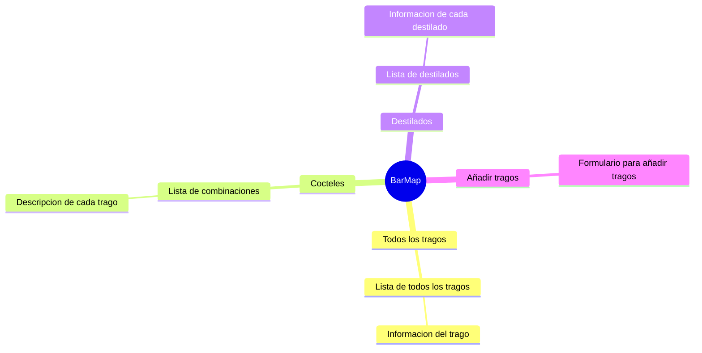

# BarApp
Nuestro proyecto corresponde a una aplicacion cross-plataform que permite a los usuarios consultar a una base de datos sobre licoreria para aprender sobre hacer tragos preparados y puedan formarse como barmans.
# Caracteristicas

- La aplicacion debe permitir elegir recetas que esten en la aplicacion para asi poder practicar y prepararlas.
- Los usuarios podran navegar por una lista de recetas para poder escoger que receta quieran hacer dependiendo de lo que tengan disponible.
- Los usuarios podran añadir recetas en caso de no estar las que quiera probar o añadir alguna creacion propia.
- El usuario podra buscar tragos por medio de filtros.
- La aplicacion tendra descripcion e imagenes de cada trago.
- La aplicacion debe garantizar la seguridad de los datos resguardando las cuentas de usuarios y derechos de autor de cada obra realizada por los usuarios a traves de todos los medios de difusion.
- Como principiante de barman, quiero poder practicar y aprender sobre recetas de tragos, para poder mejorar mis preparaciones.

## Pila de Tecnología

**Cliente:** Flutter, AndroidSDK

